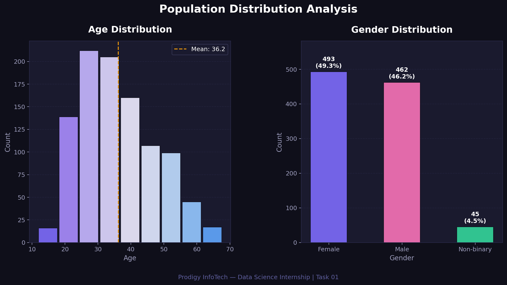

# 📊 Prodigy InfoTech — Data Science Internship

## Task 01: Population Distribution Analysis



## 📌 Task Description
> Create a bar chart or histogram to visualize the distribution of a categorical or continuous variable, such as the distribution of ages or genders in a population.

**Track:** Data Science | **TrackCode:** DS | **Task:** 01

---

## 🛠️ Tools & Libraries

| Tool | Purpose |
|------|---------|
| Python 3 | Core language |
| Pandas | Data handling |
| NumPy | Data generation & stats |
| Matplotlib | Visualization |

---

## 📈 Visualizations

### 1. Age Distribution (Histogram)
- Displays the spread of ages across 1000 individuals
- Color-coded bins for easy reading
- Mean age marked with a dashed reference line

### 2. Gender Distribution (Bar Chart)
- Shows count and percentage for each gender category
- Clear labels on each bar for quick insight

---

## 🚀 How to Run

```bash
# Clone the repo
git clone https://github.com/YOUR_USERNAME/prodigy-infotech-ds.git
cd prodigy-infotech-ds/Task-01

# Install dependencies
pip install pandas numpy matplotlib

# Run the script
python task01_prodigy_ds.py
```

---

## 💡 Key Insights
- The age distribution is **multi-modal**, with peaks around ages 25, 35, and 50
- Gender distribution is approximately **balanced** between Male and Female, with a small Non-binary segment
- Visualizations like these are the **first step** in any EDA (Exploratory Data Analysis) pipeline

---

## 🔗 Connect with Me
- **LinkedIn:** [linkedin.com/in/vuluvala-charan-reddy-141167282]
- **GitHub:** [https://github.com/charanreddy183]

---

*Part of the Prodigy InfoTech Data Science Internship Program*
