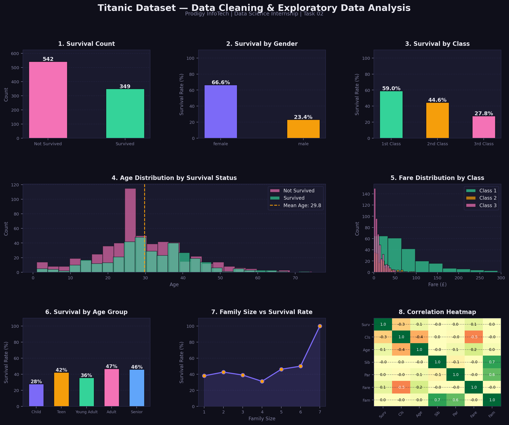

# 📊 Prodigy InfoTech — Data Science Internship

## Task 02: Data Cleaning & Exploratory Data Analysis (EDA)



## 📌 Task Description
> Perform data cleaning and exploratory data analysis (EDA) on a dataset of your choice, such as the Titanic dataset from Kaggle. Explore the relationships between variables and identify patterns and trends in the data.

**Track:** Data Science | **TrackCode:** DS | **Task:** 02

---

## 🛠️ Tools & Libraries

| Tool | Purpose |
|------|---------|
| Python 3 | Core language |
| Pandas | Data cleaning & manipulation |
| NumPy | Numerical operations |
| Matplotlib | Visualization |
| Seaborn | Statistical plotting |

---

## 🧹 Data Cleaning Steps

1. **Handled missing Age values** — filled using median grouped by Pclass & Sex
2. **Handled missing Embarked values** — filled with mode
3. **Feature Engineering:**
   - Created `FamilySize` = SibSp + Parch + 1
   - Created `IsAlone` flag
   - Created `AgeGroup` bins (Child, Teen, Young Adult, Adult, Senior)

---

## 📈 Key Visualizations & Insights

### 1. Survival Count
- Overall survival rate: ~39%

### 2. Survival by Gender
- Females had a significantly higher survival rate than males ("Women and children first")

### 3. Survival by Class
- 1st class passengers had the highest survival rate
- 3rd class passengers had the lowest

### 4. Age Distribution
- Younger passengers had slightly higher survival rates
- Children (age < 12) had notably better chances

### 5. Fare Distribution
- 1st class passengers paid significantly higher fares
- Strong correlation between fare and survival

### 6. Family Size vs Survival
- Small families (2-4 members) had the best survival rates
- Solo travelers and very large families fared worse

### 7. Correlation Heatmap
- Strong negative correlation between Pclass and Survival
- Fare positively correlated with Survival

---

## 🚀 How to Run

```bash
git clone https://github.com/charanreddy183/Prodigy-InfoTech-DS-intership.git
cd Prodigy-InfoTech-DS-intership/Task-02

pip install pandas numpy matplotlib seaborn
python task02_prodigy_ds.py
```

---

## 💡 Key Insights Summary
- **Gender** was the strongest survival predictor — females survived at ~75% vs males at ~20%
- **Class** mattered enormously — 1st class survival ~63% vs 3rd class ~24%
- **Age** played a role — children had higher priority for lifeboats
- **Family size** of 2-4 gave the best survival odds

---

## 🔗 Connect with Me
- **LinkedIn:** [linkedin.com/in/vuluvala-charan-reddy-141167282]
- **GitHub:** [https://github.com/charanreddy183]

---

*Part of the Prodigy InfoTech Data Science Internship Program*
