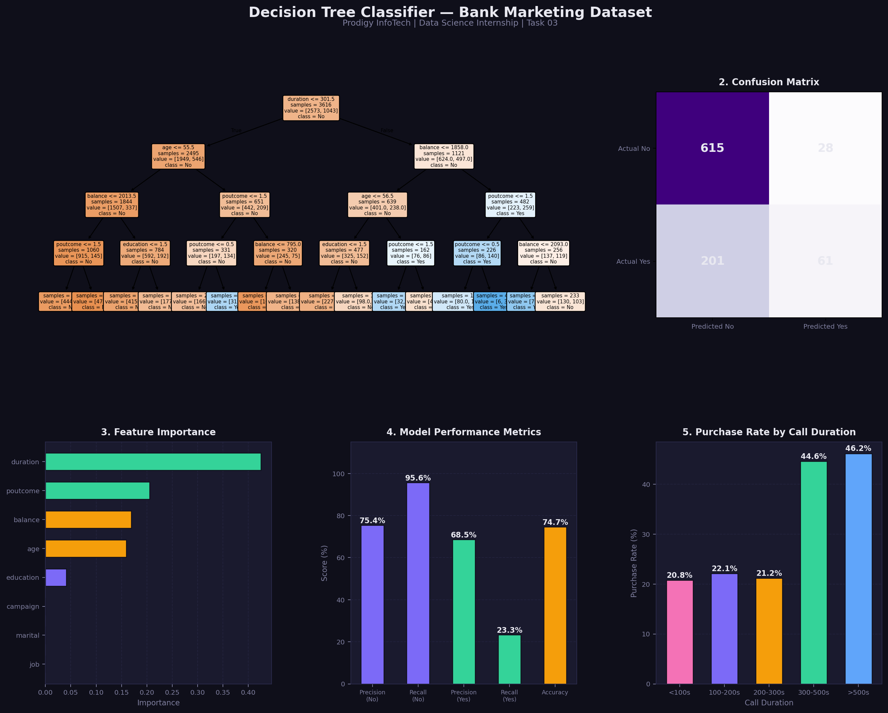

# 📊 Prodigy InfoTech — Data Science Internship

## Task 03: Decision Tree Classifier — Bank Marketing Dataset



## 📌 Task Description
> Build a decision tree classifier to predict whether a customer will purchase a product or service based on their demographic and behavioral data. Use the Bank Marketing dataset from the UCI Machine Learning Repository.

**Track:** Data Science | **TrackCode:** DS | **Task:** 03

---

## 🛠️ Tools & Libraries

| Tool | Purpose |
|------|---------|
| Python 3 | Core language |
| Pandas | Data manipulation |
| NumPy | Numerical operations |
| Scikit-learn | ML model, metrics |
| Matplotlib | Visualization |

---

## 🤖 Model Details

| Parameter | Value |
|-----------|-------|
| Algorithm | Decision Tree Classifier |
| Max Depth | 4 |
| Train/Test Split | 80% / 20% |
| **Accuracy** | **74.70%** |

---

## 📈 Key Visualizations

1. **Decision Tree Structure** — full tree with splits and decisions
2. **Confusion Matrix** — true vs predicted classifications
3. **Feature Importance** — which features drive predictions most
4. **Model Performance Metrics** — precision, recall, accuracy
5. **Purchase Rate by Call Duration** — key business insight

---

## 💡 Key Insights
- **Call duration** is the most important feature — longer calls = higher purchase rate
- Customers called for **>500 seconds** had the highest conversion rate
- **Previous campaign success** (poutcome) strongly predicts future purchase
- Model achieved **74.7% accuracy** on unseen test data

---

## 🚀 How to Run

```bash
git clone https://github.com/charanreddy183/Prodigy-InfoTech-DS-intership.git
cd Prodigy-InfoTech-DS-intership/Task-03

pip install pandas numpy matplotlib scikit-learn
python task03_prodigy_ds.py
```

---

## 🔗 Connect with Me
- **LinkedIn:** [linkedin.com/in/vuluvala-charan-reddy-141167282]
- **GitHub:** [https://github.com/charanreddy183]

---

*Part of the Prodigy InfoTech Data Science Internship Program*
