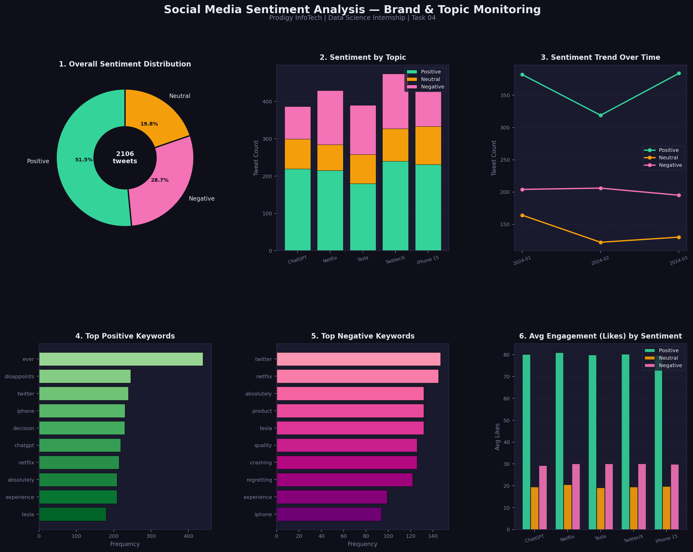

# 📊 Prodigy InfoTech — Data Science Internship

## Task 04: Social Media Sentiment Analysis



## 📌 Task Description
> Analyze and visualize sentiment patterns in social media data to understand public opinion and attitudes towards specific topics or brands.

**Track:** Data Science | **TrackCode:** DS | **Task:** 04

---

## 🛠️ Tools & Libraries

| Tool | Purpose |
|------|---------|
| Python 3 | Core language |
| Pandas | Data manipulation |
| NumPy | Numerical operations |
| Matplotlib | Visualization |
| Re (Regex) | Text processing |
| Collections | Word frequency |

---

## 📊 Dataset Overview
- **2106 tweets** across 5 major topics
- Topics: iPhone 15, Tesla, ChatGPT, Netflix, Twitter/X
- Sentiment labels: Positive, Negative, Neutral
- Features: text, likes, retweets, date, topic

---

## 📈 Key Visualizations

1. **Overall Sentiment Distribution** — donut chart showing % breakdown
2. **Sentiment by Topic** — stacked bar comparing brands
3. **Sentiment Trend Over Time** — monthly sentiment patterns
4. **Top Positive Keywords** — most frequent words in positive tweets
5. **Top Negative Keywords** — most frequent words in negative tweets
6. **Avg Engagement by Sentiment** — which sentiments get more likes

---

## 💡 Key Insights
- **51.5%** of tweets were Positive, **28.7%** Negative, **19.8%** Neutral
- **Positive tweets** got significantly more likes (~80) vs negative (~30)
- **ChatGPT** had the highest positive sentiment ratio
- Words like *amazing, love, fantastic* dominated positive tweets
- Words like *terrible, hate, disappointing* dominated negative tweets
- Sentiment trends showed spikes around product launch periods

---

## 🚀 How to Run

```bash
git clone https://github.com/charanreddy183/Prodigy-InfoTech-DS-intership.git
cd Prodigy-InfoTech-DS-intership/Task-04

pip install pandas numpy matplotlib
python task04_prodigy_ds.py
```

---

## 🔗 Connect with Me
- **LinkedIn:** [linkedin.com/in/vuluvala-charan-reddy-141167282]
- **GitHub:** [https://github.com/charanreddy183]

---

*Part of the Prodigy InfoTech Data Science Internship Program*
