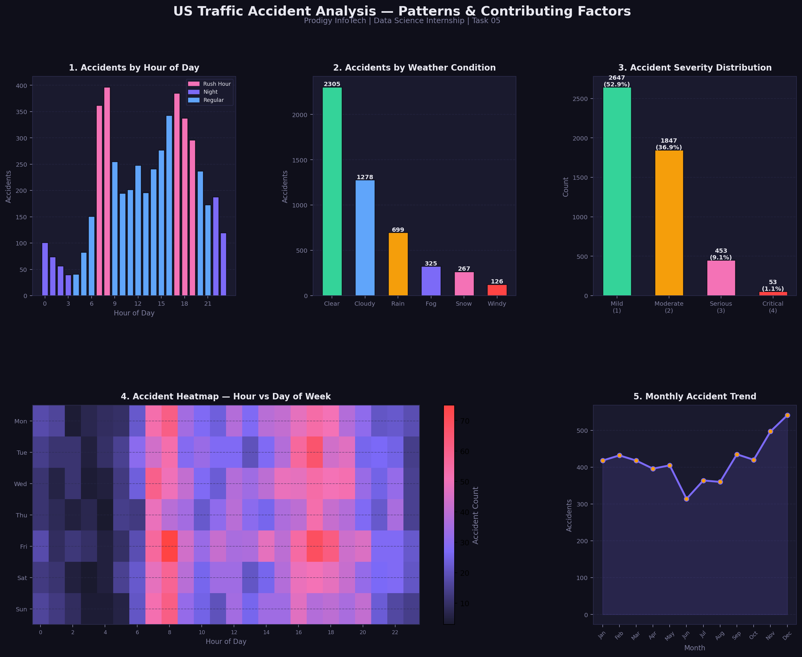

# 📊 Prodigy InfoTech — Data Science Internship

## Task 05: Traffic Accident Data Analysis



## 📌 Task Description
> Analyze traffic accident data to identify patterns related to road conditions, weather, and time of day. Visualize accident hotspots and contributing factors.

**Track:** Data Science | **TrackCode:** DS | **Task:** 05

---

## 🛠️ Tools & Libraries

| Tool | Purpose |
|------|---------|
| Python 3 | Core language |
| Pandas | Data manipulation |
| NumPy | Numerical operations |
| Matplotlib | Visualization & Heatmap |

---

## 📊 Dataset Overview
- **5000 accident records** across 10 US states
- Features: hour, weather, road condition, severity, state, day, month, light condition
- Severity scale: 1 (Mild) → 4 (Critical)

---

## 📈 Key Visualizations

1. **Accidents by Hour of Day** — rush hour & night patterns highlighted
2. **Accidents by Weather Condition** — clear vs adverse weather
3. **Severity Distribution** — breakdown of mild to critical accidents
4. **Heatmap: Hour vs Day of Week** — when accidents peak most
5. **Monthly Accident Trend** — seasonal patterns throughout the year

---

## 💡 Key Insights
- **Rush hours (7-9 AM & 5-7 PM)** have the highest accident counts
- **Clear weather** has the most accidents due to higher traffic volume
- **Rain & Fog** significantly increase accident severity
- **Friday evenings** are the most dangerous time on roads
- **Winter months (Nov-Jan)** show higher accident rates
- **52.9%** of accidents are mild, but **10.6%** are serious or critical

---

## 🚀 How to Run

```bash
git clone https://github.com/charanreddy183/Prodigy-InfoTech-DS-intership.git
cd Prodigy-InfoTech-DS-intership/Task-05

pip install pandas numpy matplotlib
python task05_prodigy_ds.py
```

---

## 🔗 Connect with Me
- **LinkedIn:** [linkedin.com/in/vuluvala-charan-reddy-141167282]
- **GitHub:** [https://github.com/charanreddy183]

---

*Part of the Prodigy InfoTech Data Science Internship Program*
